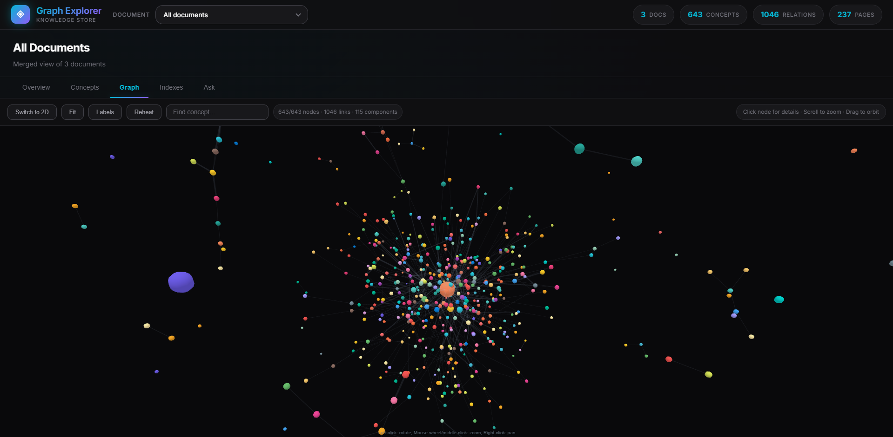
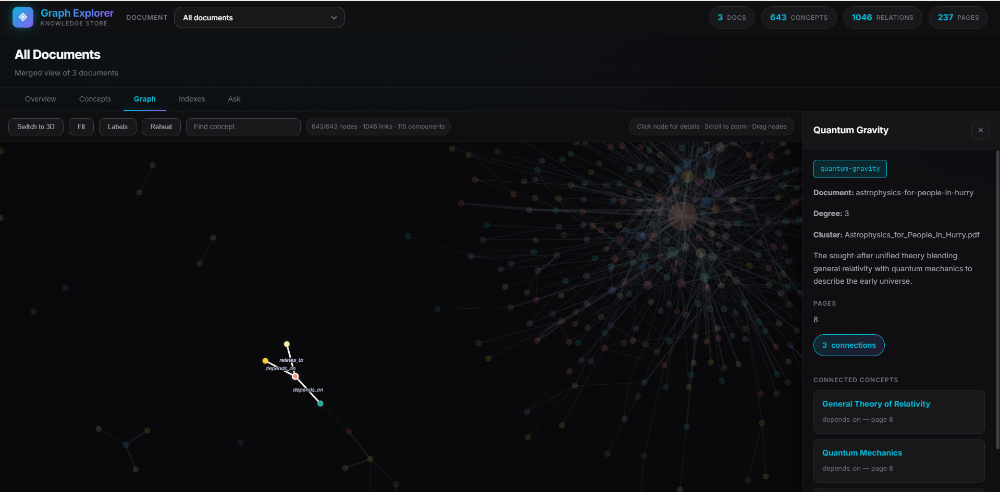
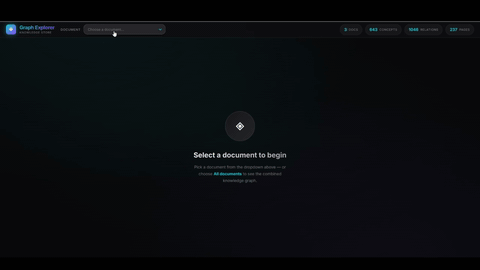

## Overview

1. **Parse** — `UniversalDocumentParser` converts PDF, DOCX, PPTX, PPT, and Markdown into Markdown/Text/JSON.
2. **Build Knowledge** — `knowledge_builder.build_kb()` extracts concepts, relationships, keywords, aliases, and indexes into an OKF bundle.
3. **Query** — `query_engine.ask()` answers natural-language questions using deterministic retrieval and grounded generation.

A browser-based UI lets you explore bundles, concept graphs, pages, indexes, and ask questions visually.

## Quick Start

### 1. Install Packages

Install the three pipeline packages in editable mode:

```bash
# Universal Document Parser (pyproject.toml is in libs/)
cd libs
pip install -e .
cd ..

# Knowledge Builder
cd libs/Knowledge_Builder
pip install -e .
cd ../..

# Query Pipeline has no pyproject.toml; just install its dependency
pip install "litellm>=1.40.0,<1.92.0"
```

For UI graph rendering, install frontend dependencies once:

```bash
cd UI
npm install
cd ..
```

> `server.py` itself has no npm dependency, but the graph views load libraries from `UI/node_modules/`.

### 2. Set API Key

The Knowledge Builder and Query Pipeline use LiteLLM. Export your key:

```bash
export MOONSHOT_API_KEY="sk-..."
```

The UI server also reads `MOONSHOT_API_KEY` from the environment.

### 3. Parse a Document

See `parser.py` for a complete example:

```python
from pathlib import Path
from libs.UDP.universal_document_parser import UniversalDocumentParser as UPD

parser = UPD(verbose=True)

input_filepath = "input/ARTIFICIAL_INTELLIGENCE_ITS_APPLICATION.pdf"
output_dir = Path("ParsedOutput")
output_filepath = output_dir / (Path(input_filepath).stem + "_2.md")

result = parser.parse(input_filepath, output_format="markdown")

with open(output_filepath, "w", encoding="utf-8") as f:
    f.write(result)
```

Run it directly:

```bash
python parser.py
```

### 4. Build a Knowledge Bundle

See `k_builder_test.py` for a complete example:

```python
import sys
from pathlib import Path

KB_ROOT = Path("libs/Knowledge_Builder").resolve()
if str(KB_ROOT) not in sys.path:
    sys.path.insert(0, str(KB_ROOT))

from libs.Knowledge_Builder.knowledge_builder import build_kb

CONFIG = {
    "model_name": "moonshot/kimi-k2.6",
    "provider": "moonshot",
    "api_key": "sk-...",  # use MOONSHOT_API_KEY env var instead
    "base_url": "https://api.moonshot.ai/v1",
    "knowledge_store_path": "./knowledge_store",
    "num_sub_agents": 5,
    "page_batch": 2,
    "image_page_batch": 2,
    "extra_body": {"thinking": {"type": "disabled"}},
}

md_path = "ParsedOutput/ARTIFICIAL_INTELLIGENCE_ITS_APPLICATION_2.md"
result = build_kb(file_path=md_path, config=CONFIG)
print(result)
```

Run it directly:

```bash
python k_builder_test.py
```

### 5. Query the Knowledge Store

See `query_test.py` for a complete example:

```python
import sys
from pathlib import Path

QUERY_ROOT = Path("libs/Query_Pipeline").resolve()
if str(QUERY_ROOT) not in sys.path:
    sys.path.insert(0, str(QUERY_ROOT))

from query_engine import ask

CONFIG = {
    "model_name": "moonshot/kimi-k2.6",
    "provider": "moonshot",
    "api_key": "sk-...",  # use MOONSHOT_API_KEY env var instead
    "base_url": "https://api.moonshot.ai/v1",
    "extra_body": {"thinking": {"type": "disabled"}},
    "knowledge_store_path": "./knowledge_store",
    "top_k_concepts": 5,
    "top_k_evidence_pages": 2,
    "max_context_tokens": 50000,
    "relationship_depth": 1,
}

result = ask("who was Dumbledore?", "all", CONFIG)
print(result.answer)
```

Run it directly:

```bash
python query_test.py
```

## Running the UI

The **Knowledge Store Explorer** visualizes OKF bundles and lets you ask questions in the browser.

### Start the Server

From the project root:

```bash
python UI/server.py
```

Then open http://localhost:8000 in your browser.

### Server Configuration

The server reads these environment variables:

| Variable | Default | Description |
|----------|---------|-------------|
| `MOONSHOT_API_KEY` | — | **Required.** API key for the query endpoint |
| `OKF_MODEL` | `moonshot/kimi-k2.6` | Model name (Recommended)|
| `OKF_PROVIDER` | `moonshot` | Provider |
| `OKF_BASE_URL` | `https://api.moonshot.ai/v1` | Base URL |
| `OKF_EXTRA_BODY` | `{"thinking": {"type": "disabled"}}` | Extra body JSON |
| `OKF_TOP_K_CONCEPTS` | `5` | Top concepts kept per query | (feel free to play with this value)
| `OKF_TOP_K_EVIDENCE_PAGES` | `2` | Evidence pages per concept | (feel free to play with this value)
| `OKF_MAX_CONTEXT_TOKENS` | `50000` | Context token ceiling |
| `OKF_RELATIONSHIP_DEPTH` | `1` | Graph-hop depth | (feel free to play with this value)
| `PORT` | `8000` | Server port |

Example with a custom port:

```bash
python UI/server.py 
```

### UI Features

- **Document picker** — choose any bundle under `knowledge_store/` or **All documents** for the merged graph.
- **Overview** — page counts, concept counts, relationship counts, and metadata.
- **Concepts** — searchable list of extracted concepts with detail modal.
- **Graph** — interactive 3D/2D force-directed concept graph with clustering, neighborhood highlighting, search, and filters. Requires `npm install` in `UI/`.
- **Pages** — per-page extracted content.
- **Indexes** — keyword, alias, glossary, and page indexes.
- **Ask** — ask natural-language questions and get grounded answers with citations.


*3D graph with concepts and relationships merged from all documents.*


*2D graph view with the concept detail fro one file*




## Local Testing 

Run tests from inside each package directory so imports resolve correctly:

```bash
# UDP
cd libs
pytest universal_document_parser/tests

# Knowledge Builder
cd libs/Knowledge_Builder
pytest tests

# Query Pipeline
cd libs/Query_Pipeline
pytest tests
```

## Module READMEs

- [`libs/README.md`](libs/README.md) — Universal Document Parser
- [`libs/Knowledge_Builder/README.md`](libs/Knowledge_Builder/README.md) — Knowledge Builder
- [`libs/Query_Pipeline/README.md`](libs/Query_Pipeline/README.md) — Query Pipeline
- [`UI/README.md`](UI/README.md) — Knowledge Store Explorer UI

## License

MIT
